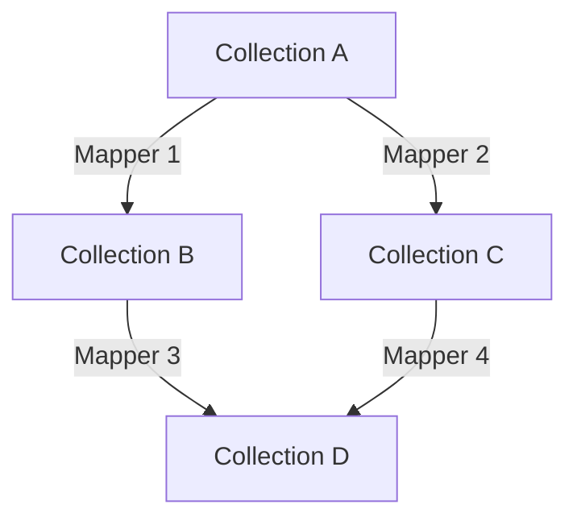
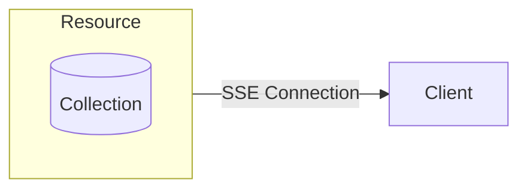
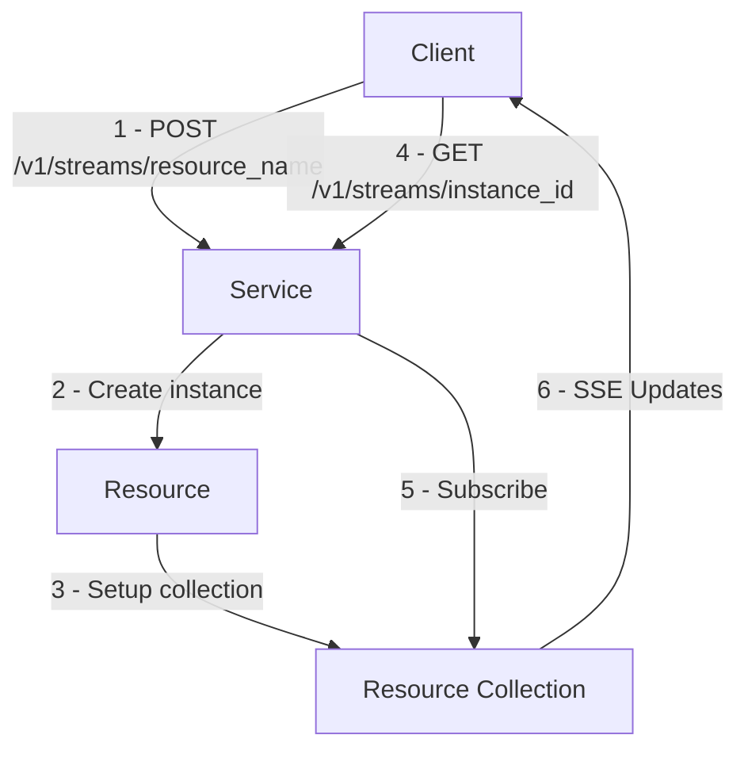
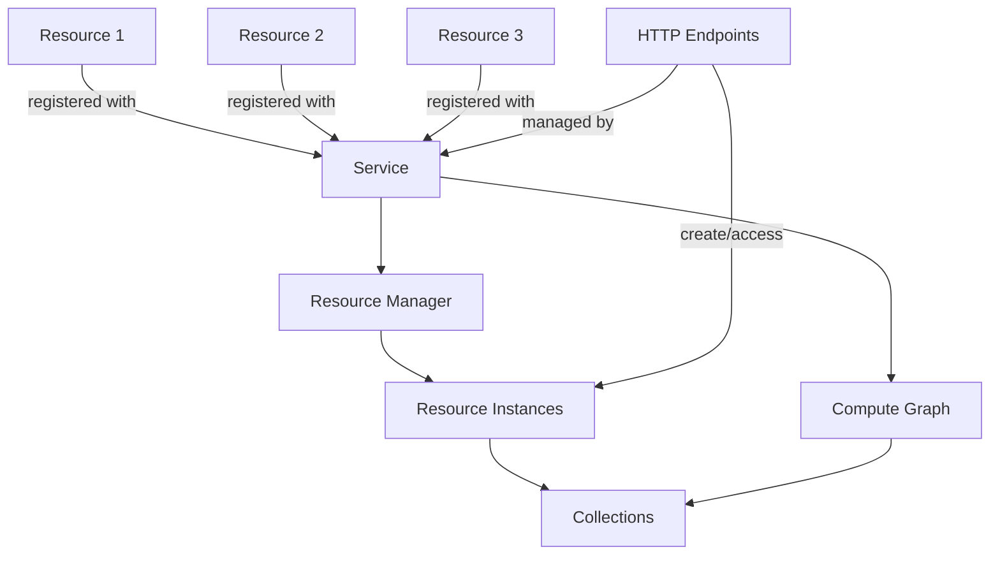
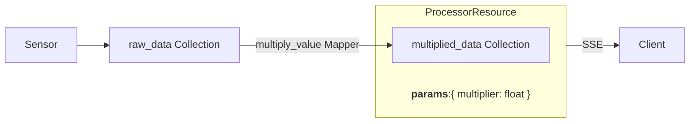
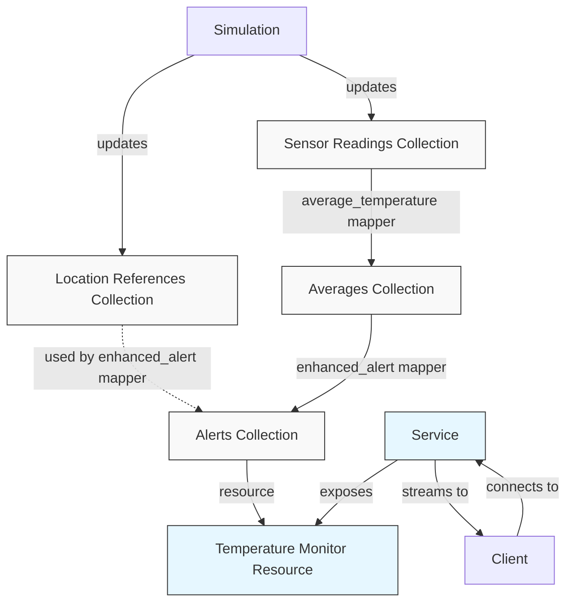
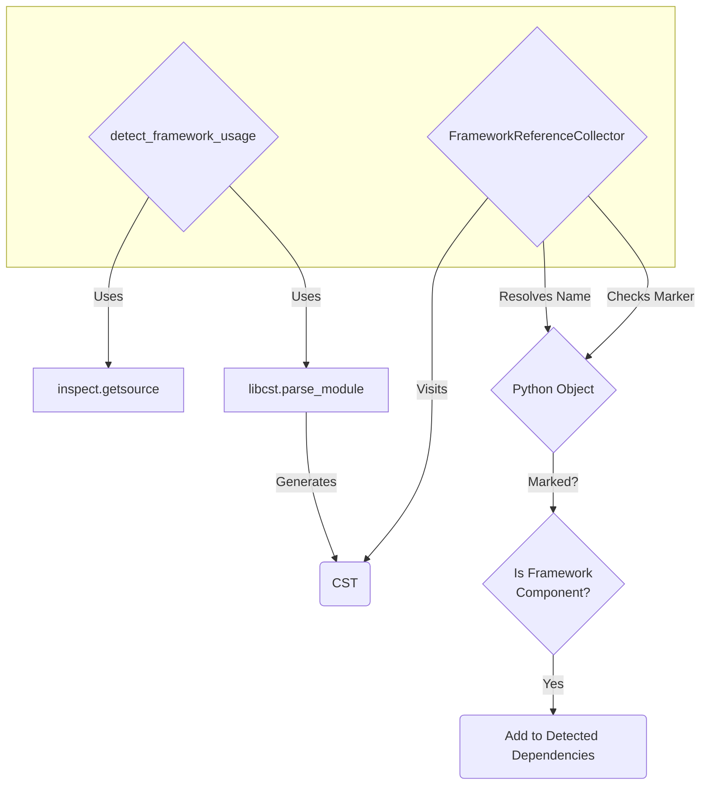
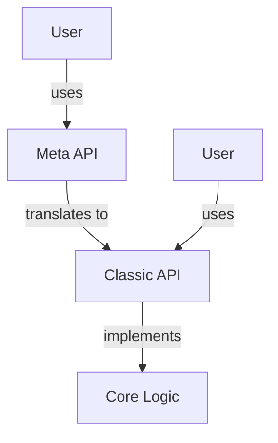
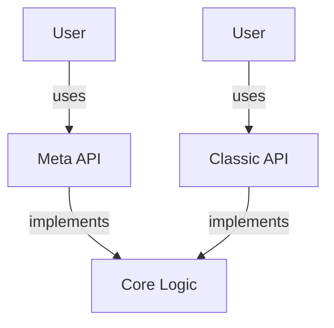

<style>
.slidev-page table th {
  background: #F3F4F6;
  font-weight: bold;
}

.code-container {
  max-height: 390px;
  overflow: auto;
  scroll-behavior: smooth;
}
</style>

<script setup>
import { ref, onMounted, onUnmounted, nextTick } from 'vue'

function debounce(func, wait) {
  let timeout
  return function executedFunction(...args) {
    const later = () => {
      clearTimeout(timeout)
      func(...args)
    }
    clearTimeout(timeout)
    timeout = setTimeout(later, wait)
  }
}

const observers = ref([])
const DEBOUNCE_DELAY = 100 

onMounted(() => {
  // Ensure observers are clean if mounted multiple times without unmount (less likely but safe)
  observers.value.forEach(obs => obs.disconnect())
  observers.value = []

  document.querySelectorAll('.code-container').forEach(container => {
    const scrollToHighlightedLine = () => {
      nextTick(() => {
        const line = container.querySelector('.highlighted, .line-highlight') 
        if (line) {
          const containerRect = container.getBoundingClientRect()
          const lineRect = line.getBoundingClientRect()
          line.scrollIntoView({
              behavior: 'smooth',
              block: 'start',
              inline: 'nearest'
          })
        }
      })
    }

    // Debounce the scroll function to prevent jank from rapid class changes
    const debouncedScrollHandler = debounce(scrollToHighlightedLine, DEBOUNCE_DELAY)

    const obs = new MutationObserver(debouncedScrollHandler)

    obs.observe(container, {
      subtree: true, 
      attributes: true,
      attributeFilter: ['class'], 
    })

    observers.value.push(obs)
  })
})

onUnmounted(() => {
  observers.value.forEach(obs => obs.disconnect())
  observers.value = []
})
</script>

# Exploring Python Metaprogramming

**By Foo Shi Yu**


---
layout: top-title-two-cols
---

:: title ::

# Outline

::left::

1.  **Introduction & Motivation**
2.  **Project Phases**
3.  **Introduction to Reactive Framework**
4.  **API Implementations**
    *   Classic API
    *   Metaprogramming API
5.  **Demo: Basic Example**
6.  **API Comparison Deep Dive**

::right::

7.  **Demo: Temperature Monitor**
8.  **Metaprogramming Internals**
    *   Decorators
    *   AST Analysis & `FrameworkDetector`
9.  **Demo 3: `FrameworkDetector`**
10. **Metaprogramming for Internal Design**
11. **Tradeoffs & Considerations**
12. **Conclusion**


---
layout: top-title
---

::title::

# Introduction & Motivation

::content::

<div class="ns-c-tight text-base">

**Visions of a Framework**
- Design and implement a next-generation distributed streaming framework
- Support applications in data analysis and machine learning
- Enable efficient, scalable, and stateful processing of streaming data
</div>

<br/>

<StickyNote color="rose-light" textAlign="left" width="full" title="The Challenge:">

<br/>
Designing intuitive, powerful, yet maintainable APIs for complex frameworks (e.g., data analytics, ML, stream processing) is difficult.

*   **Developer Experience:** APIs should be easy to learn, use, and reason about.
*   **Boilerplate:** Traditional OOP can lead to repetitive code for setup, registration, etc.
*   **Complexity:** Hiding complexity is good, but too much *"magic"* can hinder understanding and debugging.

</StickyNote>

<br/>

<StickyNote color="green-light" textAlign="left" width="full" title="The Hypothesis:">  
<br/>

We can leverage **Python metaprogramming** to create more declarative, concise, and developer-friendly framework APIs.


</StickyNote>


---
layout: top-title-two-cols
---

::title::

# Project Phases

::left::

**Semester 1: Theoretical Exploration**

* **Analyzed open source projects:** Dissected frameworks like `stateflow` and `SGLang` to understand how they use metaprogramming.
* **Identified patterns:** Recognized common techniques like intermediate representations and abstraction of distributed complexity.
* **Built a simple demo (`meta_task_runner`):** Created a basic task execution framework to experiment with metaprogramming.

::right::
**Semester 2: Practical Application & Comparison**

*   **Developed "Reactive Framework":** A more substantial framework as a concrete testbed.
    <div class="ns-c-tight">
    
    1.  Embody core concepts for potential future stream processing work.
    2.  A platform for direct API comparison.
    </div>  
*   **Implemented and compared two APIs:**
    <div class="ns-c-tight">
    
    - **Classic API:** Traditional OOP approach.
    - **Metaprogramming API:** Leverages metaprogramming for a streamlined API.
    </div> 
    


---
layout: top-title
---

::title::

# The Reactive Framework

::content::

## Why a Reactive Framework?

- A concrete testbed to implement and compare API design philosophies.
    <div class="ns-c-tight">

    - **Classic API**
    - **Metaprogramming API**
    </div>

- Incorporates relevant core concepts of streaming systems
    <div class="ns-c-tight">

    - **Collections**: Data sources
    - **Mappers**: Transformation pipelines
    - **Resources**: Exposed data streams
    </div>


---
layout: top-title
---

::title::

# Reactive Framework: Core Concepts

::content::

<div class="flex flex-col h-full">
<div class="flex flex-wrap ">
<div class="w-3/5"> 

**Collections:** Key-value data stores

**Mappers:** Define data transformations between collections
- `OneToOneMapper`, `ManyToOneMapper`

**Compute Graph:** Manages dependencies and reactivity

</div>
<div class="w-2/5">



</div>
</div>
<div class="flex flex-wrap ">
<div class="w-3/5"> 

**Resources:** Entry points exposing collections through Server-Sent Events (SSE)

**Service:** Manages resources and HTTP server

</div>
<div class="w-2/5">


    
</div>
</div>
</div>


---
layout: top-title-two-cols
columns: is-5
---

::title::

# Reactive Framework: Core Concepts

::left::

### Client Access Flow

<br/>



::right::

### Overall Architecture

<br/>




---
layout: top-title
---

::title::
# API Implementation Styles

::content::

<div grid="~ cols-2 gap-4">
<div>

### Classic (`reactive.classic`)
<div class="ns-c-tight">

- **Philosophy:** Explicit, Object-Oriented
- **Implementation:** Relies on class inheritance, explicit method definitions, manual registration
- **Familiarity:** Mirrors patterns seen in many popular Python libraries (e.g., Flask, Django)
- **Goal:** A clear, understandable baseline for comparison

</div>


</div>
<div>

### Metaprogramming (`reactive.meta`)
<div class="text-base">

- **Philosophy:** Declarative, Concise
- **Implementation:** Leverages decorators (`@resource`, `@one_to_one`), metaclasses, and AST analysis for automation
- **Goal:** Reduce boilerplate and improve developer experience by off-loading responsibilities

</div>

</div>
</div>

**Why Both?** 

To directly compare the developer experience, code conciseness, maintainability, and potential pitfalls of each approach for the exact same task.


---
layout: side-title
titlewidth: is-4
align: lm-lm
---


::title::

# Demo 1 
# Basic Example

::content::

**Goals:** 

<div class="ns-c-tight text-sm">

- Provide a concrete understanding of the `Reactive Framework`
- Showcase the difference between APIs

</div>

<br/>

**Demo Setup**



<div class="ns-c-tight text-sm">

- Sensor generates values and updates `raw_data` Collection
- The collection `multiplied_data` is created with the `multiply_value` mapper
- `ProcessorResource` accepts a custom `multiplier` and exposes the `multiplied_data`
- Client streams the results via SSE.

</div>


---
layout: top-title
---

::title::

# API Comparison - Mapper Definition

::content::

<div class="grid grid-cols-2 gap-2 h-full">
<div>

## Classic


```python {all|1-3|4-11}{at:1}
class MultiValueMapper(OneToOneMapper):
    def __init__(self, multiplier: float):
        self.multiplier = multiplier

    def map_value(self, value):
        if value is None:
            return None

        return {
          "value": value.value * self.multiplier, 
          "timestamp": value.timestamp
        }
```

</div>
<div>

## Meta

```python {all|1-2|3-9}{at:1}
@one_to_one
def multiply_value(value, multiplier: float):
    if value is None:
        return None

    return {
      "value": value.value * multiplier, 
      "timestamp": value.timestamp
    }
```

</div>
</div>


---
layout: top-title
---

::title::

# API Comparison - Resource Definition & Parameters

::content::

<div class="grid grid-cols-2 gap-2 h-full">
<div>

## Classic


```python {all|5-8|1-2,7,10,13|11-15}{at:1}
class ProcessorParams(ResourceParams):
    multiplier: float


class ProcessorResource(Resource):
    def __init__(self, data_collection, compute_graph):
        super().__init__(ProcessorParams, compute_graph)
        self.data = data_collection

    def setup_resource_collection(self, params):
        multiplied_data = self.data.map(
                            MultiValueMapper, 
                            params.multiplier
                          )
        return multiplied_data
```

</div>
<div>

## Meta

```python {all|1-2|2,5|3-7}{at:1}
@resource
def processor(multiplier: float):
    multiplied_data = map_collection(raw_data, 
                        multiply_value, 
                        multiplier
                      )
    return multiplied_data
```

</div>
</div>


---
layout: top-title
---

::title::

# API Comparison - Resource Registration

::content::

<div class="grid grid-cols-2 gap-2 h-full">
<div>

## Classic


```python {all|1-7|9-13}{at:1}
# Create a service
service = Service("data_processor", port=1234)

# Create a collection for raw data
raw_data = ComputedCollection(
              "raw_data", service.compute_graph
            )

# Create and register our resource
processor = ProcessorResource(
              raw_data, service.compute_graph
            )
service.add_resource("processor", processor)
```

</div>
<div>

## Meta

```python {all|1-7|none}{at:1}
# Create a service
service = Service("data_processor", port=1234)

# Create a collection for raw data
raw_data = ComputedCollection(
              "raw_data", service.compute_graph
            )
```

</div>
</div>


---
layout: default
---

# API Comparison Deep Dive

Let's break down the key differences observed in the demo:

<div class="text-sm">

| Feature                   | Classic API                                          | Metaprogramming API                                     |
| :----------------------   | :--------------------------------------------------- | :------------------------------------------------------ |
| **Mapper Definition**     | Inherit from `OneToOneMapper` +<br/> define constructor | Decorate function (`@one_to_one`, `@many_to_one`)            |
| **Resource Definition**   | Inherit from `Resource` +<br/> define constructor   | Decorate function (`@resource`)                                  |
| **Resource Parameters**   | **Explicit**<br/> Define `ResourceParams` class           | **Automatic**<br/> Auto-generates Pydantic model           |
| **Dependency Detection**  | **Explicit**<br/> Pass collections in `map` args/`__init__` | **Automatic**<br/> AST analysis in mappers/resources     |
| **Resource Registration** | **Explicit**<br/> `service.add_resource()`                 | **Automatic**<br/> On service start via registry          |
</div>

---
layout: side-title
titlewidth: is-3
align: lm-lm
---


::title::

# Demo 2
# Temperature Monitor

::content::

**Goals:** 

<div class="ns-c-tight text-sm">

- Show how the benefits of the Metaprogramming API scale with increased complexity.

</div>

<br/>

**Demo Setup**

<div class="flex flex-row gap-1">
<div class="flex-1 text-sm">

- Multiple sensors report temperatures for different locations
- Temperature limits for each location constantly changes
- Compute average temperature per sensor `average_temperature`
- Compare averages against location-specific thresholds `enhanced_alert`
  - Generate alerts
- Stream alerts via `TemperatureMonitorResource`

</div>

<div class="flex-1">



</div>
</div>


---
layout: top-title
---

::title::

# API Comparison - Temperature Monitor

::content::

<div class="grid grid-cols-2 gap-2 h-full">
<div>

## Classic

<div class="code-container">

```python {all|1-12|15-39|41-69|45-69}{at:1}
class AverageTemperatureMapper(
    ManyToOneMapper[str, SensorReading, Tuple[float, str]]
):
    def map_values(
        self, readings: list[SensorReading]
    ) -> Tuple[float, str]:
        if not readings:
            return 0.0, ""
        avg_temp = sum(
            r.temperature for r in readings
          ) / len(readings)
        return avg_temp, readings[0].location


class EnhancedAlertMapper(
    OneToOneMapper[str, Tuple[float, str], Dict[str, str]]
):
    def __init__(self,
        location_references: ComputedCollection,
        global_threshold: float,
    ):
        self.location_references = location_references
        self.global_threshold = global_threshold

    def map_value(
        self, value: Tuple[float, str]
    ) -> Dict[str, str]:
        avg_temp, location = value
        location_info = self.location_references.get(
            location
        )

        return evaluate_temperature_alert(
            avg_temp,
            location,
            location_info,
            self.global_threshold,
        )


class MonitorParams(ResourceParams):
    threshold: float


class TemperatureMonitorResource(Resource[str, dict]):
    def __init__(
        self,
        readings_collection,
        location_ref_collection,
        compute_graph,
    ):
        super().__init__(MonitorParams, compute_graph)
        self.readings = readings_collection
        self.location_references = location_ref_collection

    def setup_resource_collection(
        self, params: MonitorParams
    ):
        averages = self.readings.map(
            AverageTemperatureMapper
        )

        alerts = averages.map(
            EnhancedAlertMapper,
            self.location_references,
            params.threshold,
        )

        return alerts
```

</div>
</div>

<div>

## Meta

<div class="code-container">

```python {all|1-10|13-22|25-35}{at:1}
@many_to_one
def average_temperature(
    readings: List[SensorReading],
) -> Tuple[float, str]:
    if not readings:
        return 0.0, ""
    avg_temp = sum(r.temperature for r in readings) / len(
        readings
    )
    return avg_temp, readings[0].location


@one_to_one
def enhanced_alert(
    value: Tuple[float, str], global_threshold: float
) -> Dict[str, str]:
    avg_temp, location = value
    location_info = location_ref_collection.get(location)

    return evaluate_temperature_alert(
        avg_temp, location, location_info, global_threshold
    )


@resource
def temperature_monitor(threshold: float):
    averages = map_collection(
        readings_collection, average_temperature
    )

    alerts = map_collection(
        averages, enhanced_alert, threshold
    )

    return alerts
```
</div>
</div>
</div>

---
layout: top-title
---

::title::

# API Comparison - Temperature Monitor

::content::

## Observations 

- The automatic dependency detection significantly simplifies the definition of the `temperature_monitor` resource and `enhanced_alert` mapper
- As complexity grows (multiple resources, inter-collection dependencies), the boilerplate reduction and declarative nature of the Meta API become even more advantageous

---
layout: section
---

# Metaprogramming API Internals


---
layout: top-title
---

::title::
# Meta API Internals

::content::

## Key Techniques:

<div class="">

- **Decorators**: Transform user functions (`@resource`, `@one_to_one`) into framework components (`Resource`/`MapperWrapper` instances)
- **AST Analysis**: Statically analyze function code to find dependencies
- **Metaclasses**: Used internally on framework classes like `Service`, `Resource` wrappers
- **Introspection**: Using inspect module to get function signatures and type hints
</div>

---
layout: top-title
---

::title::
# Meta API Internals - Decorator-Based Components

::content::

## `@resource` / `@one_to_one` / `@many_to_one`:
<div class="ns-c-tight text-base">

- Capture the decorated user function (func).
- Wrap it in a specific object (Resource instance or MapperWrapper).
</div>

<br/>

**For `@resource`:**

<div class="ns-c-tight text-base">

- Analyze function signature/hints -> create Pydantic `param_model`
- Registers the function as the setup logic
- Adds the Resource instance to `global_resource_registry`
</div>

<br/>

**For `@one_to_one`/`@many_to_one`:**
<div class="ns-c-tight text-base">

- Store function and mapper type in `MapperWrapper`.
- Trigger dependency detection (`_detect_dependencies`).
</div>


---
layout: top-title
---

::title::
# Meta API Internals - Dependency Detection

::content::

<div class="flex flex-row gap-1">
<div class="flex-1 text-sm">

1. **Marking Components:** 

<div class="ns-c-tight">

- Internal framework elements (decorators, Meta API classes) are marked with a special attribute
</div>

2. **Source Code Analysis:** 
<div class="ns-c-tight">

- `inspect.getsource()`: Retrieves the function's source code
- `libcst.parse_module()`: Parses the source into a CST
- `FrameworkReferenceCollector` (custom `libcst.CSTVisitor`): Traverses the CST
</div>

3. **Name Resolution & Checking:**
<div class="ns-c-tight">

- The visitor identifies names (`cst.Name`) and attribute accesses (`cst.Attribute`)
- If a resolved object is a **marked framework component**, its name is recorded
</div>

4. **Indirect Reference Analysis:** 
<div class="ns-c-tight">

- Uses `FunctionCallExtractor` to recursively analyze functions (using caching) to find dependencies-of-dependencies
</div>

**Result:** Returns a set of detected `ComputedCollection` dependencies

</div>

<div class="flex-1" style="transform: scale(0.9); transform-origin: top right;">



</div>
</div>


**`reactive/meta/detector.py` (Simplified)**

```python
class FrameworkReferenceCollector(cst.CSTVisitor):
    def visit_Attribute(self, node: cst.Attribute):
        # Try to resolve node.value (e.g., 'my_collection')
        resolved_obj = self.resolve_name(node.value.value)
        if isinstance(resolved_obj, ComputedCollection):
           # Check if it's a framework component we care about
           if self.detector.is_framework_component(resolved_obj):
               # Record 'my_collection.get' or similar
               self.framework_references.add(...)
```


---
layout: side-title
titlewidth: is-3
align: lm-lm
---


::title::

# Demo 3
# Framework Detector

::content::

**Goals:** 

<div class="ns-c-tight text-sm">

- Show the detector identifying components and references.

</div>


**Demo Setup**

<div class="code-container" style="max-height:350px">

```python {all|1-12|15-29|32-51|54-65|68-88}{at:1}
# ===== Framework A Setup =====
# Create a detector specific to 'Framework A'
detector_a = FrameworkDetector("framework_a")
# Get the decorator and metaclass provided by this detector
framework_a_func = detector_a.get_function_decorator()
FrameworkAClass = detector_a.get_metaclass()

# ===== Framework B Setup =====
# Create a separate detector for 'Framework B'
detector_b = FrameworkDetector("framework_b")
framework_b_func = detector_b.get_function_decorator()
FrameworkBClass = detector_b.get_metaclass()


# ===== Define Framework A Components =====
# Mark this function as belonging to Framework A
@framework_a_func
def component_a_util():
    """Framework A utility function."""
    return "Util A"


# Mark this class as belonging to Framework A using the metaclass
class ComponentA(metaclass=FrameworkAClass):
    """Framework A class."""

    def process(self):
        # This method is automatically marked as a component method by the metaclass
        return "Processed by A"


# ===== Define Framework B Components =====
# Mark this function as belonging to Framework B
@framework_b_func
def component_b_service():
    """Framework B service function."""
    return "Service B"


# Mark this class as belonging to Framework B
class ComponentB(metaclass=FrameworkBClass):
    """Framework B class."""

    def __init__(self):
        # The metaclass will trigger analysis of __init__
        # It calls a component from Framework A.
        self.util_a_result = component_a_util()

    def execute(self):
        # This method is automatically marked by the metaclass
        return f"Executed by B (using {self.util_a_result})"


# ===== Example of Stacked Decorators =====
# This function is marked as a component by both frameworks
@framework_a_func
@framework_b_func
def multi_framework_function():
    """
    A function recognized by both Framework A and Framework B detectors.
    It also uses components from both frameworks internally.
    """
    res_a = component_a_util()  # Usage of Framework A component
    res_b = component_b_service()  # Usage of Framework B component
    return f"Multi: {res_a}, {res_b}"


# ===== User Code Example Using Components =====
# User code that is also marked as a Framework A component.
# This allows detector_a to analyze its dependencies on other Framework A components.
@framework_a_func
def process_data():
    """Example user function using components from both frameworks."""
    # Using Framework A utility
    result_a = component_a_util()

    # Using Framework B service (detector A won't mark this as an 'A' reference)
    result_b = component_b_service()

    # Using Framework A class
    instance_a = ComponentA()
    processed = instance_a.process()  # Call to a Framework A method

    # Using Framework B class
    instance_b = ComponentB()
    executed = instance_b.execute()  # Call to a Framework B method

    return f"Data: {result_a}, {result_b}, {processed}, {executed}"
```

</div>


---
layout: top-title
---

::title::
# Metaprogramming for Internal Design

::content::

## Metaprogramming isn't just for user-facing APIs

**The `FrameworkDetector` itself is an example!**

<div class="ns-c-tight text-base">

- **Initial Implementation:** Dependency detection logic was scattered and coupled with the framework logic

- **Refactoring with Metaprogramming:**
  -  `get_function_decorator()`: Creates marking decorators (`@resource`, `@one_to_one`)
  -  `get_metaclass()`: Creates marking metaclasses (used on `reactive.meta.Resource`)

- **Benefits:**
  - **Decoupling:** Detection logic is centralized in `FrameworkDetector` and `CodeAnalyzer`. Marking logic is applied cleanly via decorators/metaclasses.
  - **Ease of Use (Internal):** Applying `@framework_function` or `metaclass=FrameworkClass` is simple.
  - **Extensibility:** Easy to add new detectors for different purposes. Decorators can be stacked.
</div>

---
layout: section
---

# Metaprogramming for <br/> Internal Design

---
layout: top-title
---

::title::
# Metaprogramming for Internal Design

::content::

## More Examples

<div class="ns-c-tight text-base">

This isn't a novel idea!
- **Python Built-ins:** `@property`, `@staticmethod`, `@classmethod` use metaprogramming internally

- **Framework Examples:**
  - SQLAlchemy: `@collection` provides low-level customisability to advanced-users
  - Flask/Quart: `@bp.route` decorator provided by Blueprint extension mechanism
</div>

<br/>

## Insight
<div class="ns-c-tight text-base">

- Framework developers should stay open to creating *internal* decorators/metaclasses
  - Improves code structure and maintainability
  - Possible to expose lower-level hooks for advanced users or extension developers later
</div>


---
layout: section
---

# Tradeoffs & Considerations

---
layout: top-title
---

::title::
# Tradeoffs & Considerations

::content::

<div class="ns-c-tight">

**Complexity vs. Conciseness:**
- **Pro (User):** Simpler user code.
- **Con (Maintainer):** Framework internals become much harder to understand, debug, and maintain (AST analysis, metaclass interactions). Debugging might require understanding generated code or AST logic.

**Tooling & Static Analysis:**
- **Con:** Can challenge type checkers (might need `# type: ignore` or complex stubs), IDE features ("go to definition" might point to decorator/wrapper).
- **Mitigation:** Careful implementation (e.g., `functools.wraps`) preserves basic introspection (`help()`, `__name__`, `__doc__`).

**Portability:**
- Metaprogramming features are highly Python-specific. If the framework needs SDKs in other languages (Java, Go, Rust), achieving feature parity for the "magic" (like AST-based dependency detection) might be impossible or extremely difficult, leading to inconsistent DX across languages.
</div>

---
layout: top-title
---

::title::
# Tradeoffs & Considerations

::content::

<div class="ns-c-tight">

**Development Approach & Maintainability:**
- **Con:** The high complexity of implementing metaprogramming APIs can hinder development velocity
- **Mitigation** Meta API as a Layer on Classic API
  - **Pro:** Iterative development, stable base, guaranteed compatibility.
  - **Con:** Meta API becomes coupled to Classic API implementation details
</div>

<div class="flex w-full">
<div class="flex-1" style="transform: scale(0.6); transform-origin: top right;">



</div>
<div class="flex-1" style="transform: scale(0.6); transform-origin: top center;">



</div>
</div>


---
layout: top-title
---

::title::
# Aside: Why Not a Custom DSL?

::content::

A Domain Specific Language (DSL) is another way to provide a declarative interface. Why wasn't one pursued here?
<div class="ns-c-tight text-base">

*   **Learning Curve:** Requires users to learn a new mini-language syntax and semantics

*   **Tooling Ecosystem:** A custom DSL requires significant investment in tooling:
    *   Syntax Highlighting, Linters & Formatters
    *   Language Server Protocol (LSP) for IDE integration (completion, diagnostics)
    *   Debuggers

*   **Existing Paradigms:**
    *   **Fluent APIs / Builder Pattern:** Often achieve declarative style within Python (e.g., SQLAlchemy Core).
    *   **Embedded DSLs:** Leverage Python syntax rather than creating a new one. Many successful "DSLs" are effectively just well-designed Python APIs (e.g., Pandas, Requests).

*   **Precedent:** While successful DSLs exist (SQL, Terraform HCL), there's also a trend towards general-purpose languages for tasks previously handled by DSLs (e.g., Pulumi using Python/TS/Go vs. Terraform HCL, ORMs vs. raw SQL).

**Decision:** Focus on enhancing the API *within* Python using metaprogramming, leveraging the existing rich ecosystem, rather than creating a separate language.
</div>


---
layout: side-title
titlewidth: is-3
---

::title::

# Conclusion

::content::


<div class="ns-c-tight">

- **Metaprogramming offers tangible benefits for framework API design:**
  - Reduced boilerplate
  - More declarative style
  - Automation of common tasks (dependency detection, registration)
</div>

- **Internal Metaprogramming is valuable:** Techniques like decorators/metaclasses can improve framework implementation structure and maintainability (e.g., `FrameworkDetector`).

<div class="ns-c-tight">

- **Tradeoffs are significant:** 
  - Increased internal complexity
  - Potential tooling friction
  - "Magic" obscuring cause-and-effect
  - Portability concerns
</div>


---
layout: cover
class: "text-center"
---

# Thank You

## Q&A

**Project Repository:** [https://github.com/CFSY/meta-reactive](https://github.com/CFSY/meta-reactive)

**Documentation Site:** [https://cfsy.github.io/fyp-docs/](https://cfsy.github.io/fyp-docs/)

